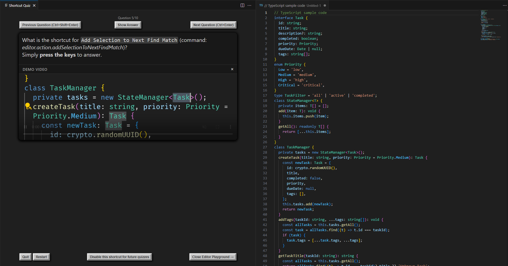
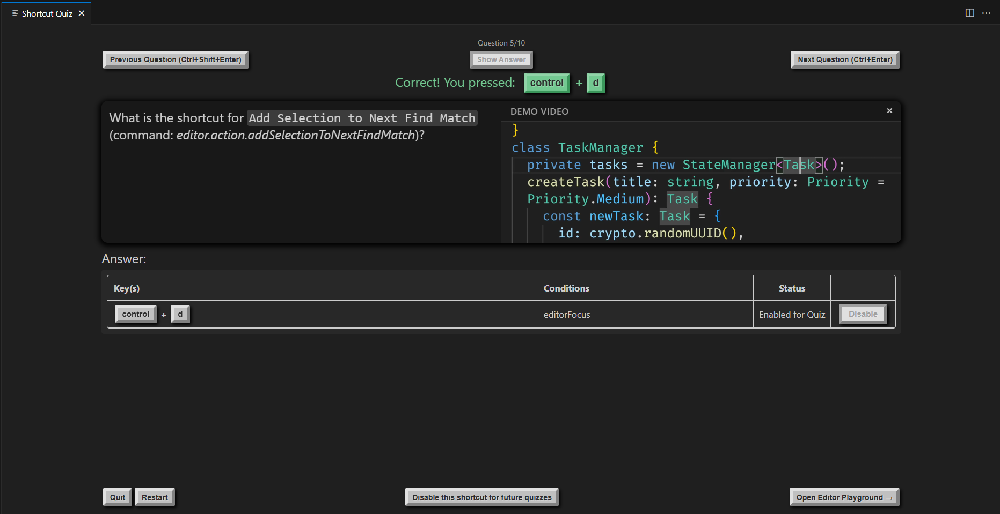

# Shortcut Quiz

Shortcut Quiz is a Visual Studio Code extension designed to help users learn and practice keyboard shortcuts interactively. It is particularly useful for developers and power users who want to improve their productivity by mastering shortcuts.

## Features

- Interactive quiz to test your knowledge of Visual Studio Code keyboard shortcuts.
- Real-time feedback on correct and incorrect key presses.
- Support for multi-step shortcut sequences (e.g., `Ctrl+K Ctrl+C`).
- Visual hints for keyboard shortcuts, including modifiers like `Ctrl`, `Shift`, `Alt`, and `Meta`.
- Integration with Visual Studio Code's shortcut data, ensuring up-to-date shortcuts.

## Screenshots

### Example Quiz Question

### Example Quiz Answer

## How It Works

The Shortcut Quiz extension is designed to help users master Visual Studio Code shortcuts through periodic quizzes. Here's how it works:

- **Periodic Quizzes**:

  - The extension periodically opens a quiz to challenge users with questions about Visual Studio Code shortcuts.
  - The interval between quizzes can be customized through the extension settings, allowing users to control how often they are prompted.

- **Dynamic Shortcut Selection**:

  - Shortcuts are selected dynamically based on a scoring system.
  - Each shortcut has a score that increases when the user answers correctly and decreases when the user answers incorrectly.
  - This ensures that shortcuts the user struggles to remember are prioritized in future quizzes, helping users focus on improving their weakest areas.

- **Interactive Learning**:

  - Users receive real-time feedback on their answers, helping them learn and retain the correct shortcuts more effectively.
  - The extension supports multi-step shortcut sequences (e.g., `Ctrl+K Ctrl+C`), ensuring comprehensive coverage of Visual Studio Code shortcuts.

- **Personalized Experience**:
  - By focusing on shortcuts that users find challenging, the extension provides a tailored learning experience.
  - Over time, users can track their progress and see improvements in their shortcut mastery.

This approach ensures that users not only learn new shortcuts but also reinforce the ones they find most difficult, leading to better productivity and confidence in using Visual Studio Code.

## Requirements

- Visual Studio Code version 1.98.0 or higher.

## Extension Settings

This extension contributes the following settings:

- `shortcutQuiz.keyboardLayout`: The keyboard layout to use for shortcut matching. Default is `en`.
- `shortcutQuiz.quizInterval`: The interval (in minutes) between quizzes. Default is `60`.
- `shortcutQuiz.numberOfQuestions`: The number of questions in each quiz. Default is `10`.
- `shortcutQuiz.maxWrongTries`: The maximum number of wrong tries before the answer is revealed. Default is `10`.
- `shortcutQuiz.showPlayground`: Whether to show the playground editor for quizzes by default. Default is `true`.
- `shortcutQuiz.showDemoVideo`: Whether to show the demo video for quizzes by default. Default is `true`.
- `shortcutQuiz.quizSelection`: How to select the shortcuts for the next quiz. Default is `lowest_score`.
- `shortcutQuiz.keyboardLayout`: The keyboard layout to use for shortcut matching. Default is `en`.
